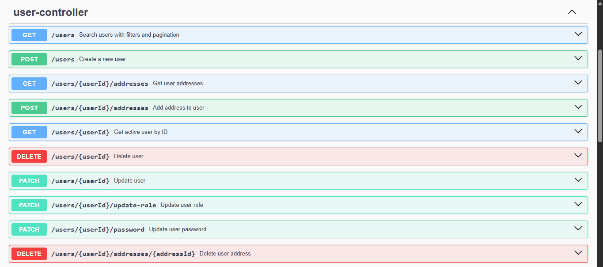

# E-commerce Backend API

Backend API for an e-commerce system built with Java and Spring Boot.

This project focuses on building a robust and secure REST API, applying best practices such as layered architecture,
domain-driven design (DDD), validation, exception handling, and JWT-based authentication.

---

## 🚧 Project Status

In active development — currently expanding test coverage and improving architecture.

---

## 🔄 API Flow

1. User registers or logs in
2. Receives JWT token
3. Uses token to access protected endpoints
4. Manages resources (User, Address) securely

---

## ⚙️ Tech Stack

- Java 17+
- Spring Boot
- Spring Security
- JWT (Authentication & Authorization)
- JPA / Hibernate
- H2 Database
- Maven

---

## 🚀 Features

- User management (CRUD)
- Address management with domain-level validation and consistency rules
- Authentication and authorization using JWT
- Role-based access control
- Global exception handling with standardized error responses
- Input validation with custom constraints

---

## 🔐 Security

- Stateless authentication using JWT
- Custom authentication and authorization handlers
- Role-based access control using Spring Security
- Secure password hashing with BCrypt

---

## 🧠 Design Decisions

- Domain-driven design (DDD) approach for entity modeling
- User acts as the aggregate root, controlling the lifecycle of related entities such as Address
- Validation is enforced at the domain level to ensure consistency

---

## 📌 Example Request

POST /auth/login

```json
{
  "email": "admin@test.com",
  "password": "123456"
}
```

---

## 📌 Example Response

```json
{
  "token": "jwt_token_here"
}
```

---

## ▶️ Running the application

### 1. Clone the repository

```bash
git clone https://github.com/bruno-moura-dev/ecommerce-api.git
cd ecommerce-api
```

---

### 2. Set environment variables

```env
ADMIN_USERNAME=admin@test.com
ADMIN_PASSWORD=123456
ADMIN_ROLE=ADMIN
JWT_SECRET=ecommerce-api-secret-key-2026
JWT_EXPIRATION=3600000
```

The admin user is created on application startup using the provided environment variables.

---

### 3. Run the application

```bash
./mvnw spring-boot:run
```

Or run the main class from your IDE:

```md
EcommerceApiApplication
```

---

## 📚 API Documentation

Swagger UI available at:

http://localhost:8080/swagger-ui.html

---

## 📸 API Preview



---

## 🔮 Future Improvements

- Implementation of additional e-commerce domains (Product, Order, Cart, etc.)
- Integration tests
- Docker containerization
- Sorting support (ORDER BY) for paginated queries
- Performance optimizations

---

## 📝 Notes

This project was developed as part of my backend learning journey, focusing on building production-like APIs using
clean architecture, domain-driven design principles, and industry best practices.

---

## 🚀 Final Notes

This project simulates a real-world backend application, focusing on clean architecture, security, and maintainability.